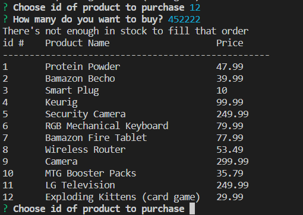

# Bamazon-Cli

## Overview

Bamazon uses queries a MySQL database using the npm mysql package. You can access the Bamazon store either as a customer or manager, and have different abilities based on which .js file you run.

### Bamazon Customer

Running the bamazonCustomer file in node will first display all of the products on sale (in inventory). It then gives the user 2 prompts:

    * Asking the user for the ID of the product they would like to buy
    * Asking the user how many units they would like to buy

Once the customer has placed the order, this application processes the order as follows:

    * If there is not enough inventory, it tells the user and returns them to the product selection screen
    * If there is enough inventory, the correct quantity is depleted from the database and the total cost of the customer's order is shown

### Bamazon Manager

Runnning the bamazonManager.js file in node will give you different options than the customer view. In the manager view, you can:

    * View Products for Sale
    * View Products with Low Inventory
    * Add Inventory to an existing product
    * Add a New Product

Selecting `View Products for Sale` will list all available items, including id, prices, and quantities

Selecting `View Low Inventory` will list only the items with an inventory count lower than five.

Selecting `Add to Inventory` will prompt the manager to select an item's id and choose how much inventory to add.

Selecting `Add New Product` it will prompt the manager to add a new product by inputting name, price, and starting quantity.

